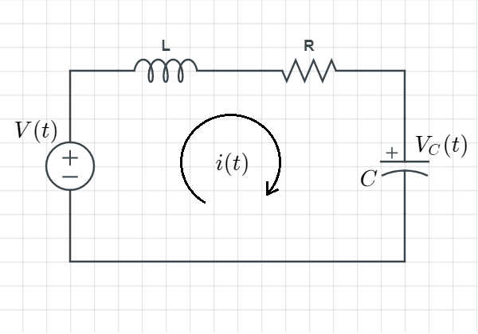
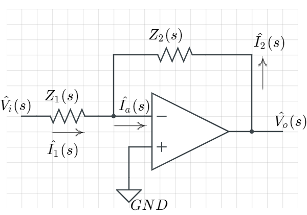
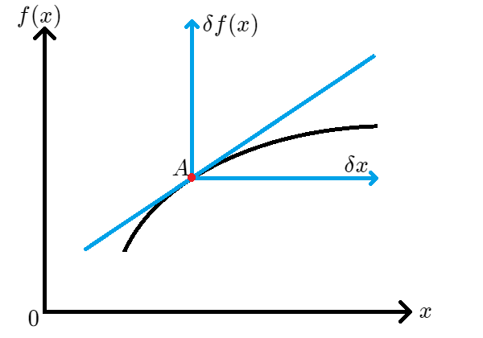

# 第二章 轉移函數

- [第二章 轉移函數](#第二章-轉移函數)
  - [2.2 Laplace Transform (拉普拉斯轉換) ***考試重點***](#22-laplace-transform-拉普拉斯轉換-考試重點)
    - [Partial-Fraction Expansion (部分分式展開)](#partial-fraction-expansion-部分分式展開)
      - [Ex. $\mathcal{F}(s) = \frac{s^3 + 2s^2 + 6s + 7}{s^2 + s + 5}$](#ex-mathcalfs--fracs3--2s2--6s--7s2--s--5)
    - [2.3 The Transfer Function (轉移函數)](#23-the-transfer-function-轉移函數)
      - [Ex. 給定 代表某個系統的 n 階方程式](#ex-給定-代表某個系統的-n-階方程式)
    - [2.4 電路的轉移函數 ***考試重點***](#24-電路的轉移函數-考試重點)
      - [元件特性表](#元件特性表)
      - [Ex2.6 求此電路的轉移函數 $\frac{\hat{V_C}(s)}{\hat{V}(s)}$](#ex26-求此電路的轉移函數-frachatv_cshatvs)
      - [Ex2.10 用網目分析的方法求此電路的轉移函數 $\frac{\hat{I_2}(s)}{\hat{V}(s)}$](#ex210-用網目分析的方法求此電路的轉移函數-frachati_2shatvs)
      - [Ex2.11 用節點分析的方法求此電路的轉移函數 $\frac{\hat{V_C}(s)}{\hat{V}(s)}$](#ex211-用節點分析的方法求此電路的轉移函數-frachatv_cshatvs)
      - [Inverting Operational Amplifier (反向運算放大器) 的轉移函數](#inverting-operational-amplifier-反向運算放大器-的轉移函數)
      - [Noninverting Operational Amplifier (非反向運算放大器) 的轉移函數](#noninverting-operational-amplifier-非反向運算放大器-的轉移函數)
    - [2.5 Translational Mechanical System Transfer Functions 移動式機械系統轉移函數](#25-translational-mechanical-system-transfer-functions-移動式機械系統轉移函數)
    - [2.8 Electromechanical System Transfer Functions 機電系統的轉移函數](#28-electromechanical-system-transfer-functions-機電系統的轉移函數)
    - [2.10 Nonlinearities 非線性](#210-nonlinearities-非線性)
    - [2.11 Linearization 線性化](#211-linearization-線性化)

## 2.2 Laplace Transform (拉普拉斯轉換) ***考試重點***

### Partial-Fraction Expansion (部分分式展開)

假設$\mathcal{F}(s)$長得很複雜，複雜到難以直接計算拉普拉斯轉換  
那麼將$\mathcal{F}(s)$拆分成  
$\mathcal{F}(s) = 簡單項 + 簡單項 + 簡單項 ......$的形式，再逐項進行拉式轉換  
就會容易得多  
(拉式轉換性質：$\mathcal{L}[f_1 + f_2] = \mathcal{L}[f_1] + \mathcal{L}[f_2]$)  

那如果像這個結構 $\mathcal{F}(s) = \frac{\mathcal{N}(s)}{\mathcal{D}(s)}$  
其中分子的階數 $\ge$ 分母階數的話  

-------------------------------------------------------------------------------------------------------------------------------------------------------

#### Ex. $\mathcal{F}(s) = \frac{s^3 + 2s^2 + 6s + 7}{s^2 + s + 5}$  

>這時候就要先把分子不斷地除以分母，直到留下一個 分子階數 $\lt$ 分母階數 的餘數  
>
>$\mathcal{F(s)} = s + 1 + (\frac{2}{s^2 + s + 5})$  
>這樣上式的前兩項就可以簡單的做反拉式轉換了  
>$f(t) = \frac{d\delta(t)}{dt} + \delta(t) + \mathcal{L^{-1}}[\frac{2}{s^2 + s + 5}]$  
>第三項則根據分母的狀況來決定拆法  
>本例中應採用第三種方法

>根據結構有三種拆法：  

>1. 分母有不同實數根  
>>  比如說：$\mathcal{F}(s) = \frac{2}{(s+1)(s+2)}$  
>>  可以拆成：$\mathcal{F}(s) = \frac{K_1}{s+1} + \frac{K_2}{s+2}$  
>>  並得到：$\mathcal{F}(s) = \frac{2}{s+1} - \frac{2}{s+2}$  

>2. 分母的根為實數根，且有重根  
>>  比如說：$\mathcal{F}(s) = \frac{2}{(s+1)(s+2)^2}$  
>>  可以拆成：$\mathcal{F}(s) = \frac{K_1}{(s+1)} + \frac{K_2}{(s+2)^2} + \frac{K_3}{(s+2)}$  
>>  也就是重根項依其次數逐項遞減列出  
>>  $\frac{2}{(s+1)(s+2)^2} = \frac{K_1}{(s+1)} + \frac{K_2}{(s+2)^2} + \frac{K_3}{(s+2)}$  
>>  $\frac{2}{(s+2)^2} = K_1 + \frac{K_2(s+1)}{(s+2)^2} + \frac{K_3(s+1)}{(s+2)}$  
>>  $2 = K_1(s+2)^2 + K_2(s+1) + K_3(s+1)(s+2)$  
>>  並得到：$\mathcal{F}(s) = \frac{K_1}{(s+1)} + \frac{K_2}{(s+2)^2} + \frac{K_3}{(s+2)}$  

>3. 分母的根為複數根
>>  比如說：$\mathcal{F}(s) = \frac{3}{s(s^2 + 2s + 5)}$  
>>  可以先換成[1]式：$\frac{3}{s(s^2 + 2s + 5)} = \frac{K_1}{s} + \frac{K_2s + K_3}{s^2 + 2s + 5}$  
>>  兩邊同$\times s$：$\frac{3}{s^2 + 2s + 5} = K_1 + \frac{K_2s^2 + K_3s}{s^2 + 2s + 5}$  
>>  令$s \rightarrow 0：\frac{3}{5} = K_1$，這樣就先求得$K_1$  
>
>>  [1]式兩邊同$\times$最低公分母$s(s^2 + 2s + 5)$  
>>  $3 = \frac{3}{5}(s^2 + 2s + 5) + K_2s^2 + K_3s$  
>>  再整理成$s$的係數多項式  
>>  $\Rightarrow 3 = (K_2 + \frac{3}{5})s^2 + (K_3 + \frac{6}{5})s + 3$  
>>  因[1]式已經假設為左右兩式函數圖形相等  
>>  所以 $s^2$、$s$ 的係數必定為 $0$(左多項式只剩常數)，那就可以求得  
>>  $K_2 + \frac{3}{5} = 0 \Rightarrow K_2 = -\frac{3}{5}$  
>>  $K_3 + \frac{6}{5} = K_3 = -\frac{6}{5}$  
>
>>  代回[1]式：  
>>  $\mathcal{F}(s) = \frac{3}{s(s^2 + 2s + 5)} = \frac{\frac{3}{5}}{s} - \frac{-\frac{3}{5} -\frac{6}{5}}{s^2 + 2s + 5}$  
>>  整理：
>>  $\mathcal{F}(s) = \frac{3}{s(s^2 + 2s + 5)} = \frac{\frac{3}{5}}{s} - \frac{3}{5}\times\frac{s + 2}{s^2 + 2s + 5}$  

同樣地，拆分後的項足夠簡單(可直接查表)時就可以直接做拉普拉斯轉換

-------------------------------------------------------------------------------------------------------------------------------------------------------

### 2.3 The Transfer Function (轉移函數)

一言以蔽之：0初始條件、0平衡點下，輸入與輸出的關係式  
$\it{G(s)} = \frac{Output}{Input}$  

初始條件：輸入為0、時間在0以前 的***恆定***輸出

>給定一個系統(以方程式來描述其系統行為)  
>定義其中的 某項為輸入、某項為輸出，初始條件設為$0$  
>求 $\frac{輸出}{輸入}$ 的樣子的過程，就是在求轉移函數  
>最精簡的例子(只是直觀理解，實際上不應該用此例)：  
>$y = f(x) = 2x + 3$  
>定義 $x$ 為輸入，$y$ 為輸出，那 $3$ 則為初始條件  
>則轉移函數為 $\frac{y}{x} = 2$  

標準流程：

1. 給定系統方程式
2. 定義輸入輸出
3. 兩邊做拉普拉斯轉換
4. 設定初始條件為 $0$
5. 移項為 $\frac{輸出}{輸入}$ 的形式

-------------------------------------------------------------------------------------------------------------------------------------------------------

#### Ex. 給定 代表某個系統的 n 階方程式

>　　$a_n\frac{d^nc(t)}{dt^n} + a_{n-1}\frac{d^{n-1}c(t)}{dt^{n-1}} + ... + a_1\frac{dc(t)}{dt} + a_0c(t) = b_m\frac{d^mr(t)}{dt^m} + b_{m-1}\frac{d^{m-1}r(t)}{dt^{m-1}} + ... + b_1\frac{dr(t)}{dt} + b_0r(t)$  
>　　其中 $c(t)$ 為輸出，$r(t)$ 為輸入
>　　求其轉移函數  

Recall:  
　　$\mathcal{L[c(t)]} = s^n\mathcal C(s) - s^{n-1}c(0) - s^{n-2}c'(0) - ... - sc^{(n-2)}(0) - c^{(n-1)}(0)$  
　　初始條件定義其一為時間為0，恰好上式時域項 $c(t)$ 都是代入 $0$。因此上式時域的項加總為初始條件 $- (s^{n-1}c(0) + s^{n-2}c'(0) +...)$
>1. 兩邊拉式轉換 (逐項轉換後的 第一項加總 + 初始條件加總)
>>  $　[a_ns^nC(s) + a_{n-1}s^{n-1}C(s) + ... + a_0C(s)] + c(t)的初始條件$  
>>  $= [b_ns^nR(s) + b_{n-1}s^{n-1}R(s) + ... + b_0R(s)] + b(t)的初始條件$  
>
>>  並且 $令　初始條件 = 0$  
>>  $　a_ns^nC(s) + a_{n-1}s^{n-1}C(s) + ... + a_0C(s)$  
>>  $= b_ns^nR(s) + b_{n-1}s^{n-1}R(s) + ... + b_0R(s)$  
>
>>  提取係數  
>>  $　(a_ns^n + a_{n-1}s^{n-1} + ... + a_0)C(s)$  
>>  $= (b_ns^n + b_{n-1}s^{n-1} + ... + b_0)R(s)$  
>   移項後得出轉移函數  
>>  $\frac{C(s)}{R(s)} = \frac{a_ns^n + a_{n-1}s^{n-1} + ... + a_0}{b_ns^n + b_{n-1}s^{n-1} + ... + b_0}$  

-------------------------------------------------------------------------------------------------------------------------------------------------------

### 2.4 電路的轉移函數 ***考試重點***

標準流程：

1. KVL/KCL列式
2. 拉式轉換為頻域
3. 代入元件特性
4. 聯立/移項 求出$\frac{Output}{Input}$

>電流 $I$ 被定義為輸出時，用網目分析/KVL求解  
>電壓 $V$ 被定義為輸出時，用節點分析/KCL求解

運用 ***元件特性***、***KVL/KCL***、***數學***來將整個電路寫成函數  

#### 元件特性表

|  元件  |            時域特性            | 頻域特性(用$\hat{F}$代表拉氏轉換後的頻域) |
| :----: | :----------------------------: | :---------------------------------------: |
| 電阻 R |       $V_R(t) = i_R(t)R$       |      $\hat{V_R}(s) = \hat{i_R}(s)R$       |
| 電感 L | $V_L(t) = L\frac{di_L(t)}{dt}$ |      $\hat{V_L}(s) = \hat{i_L}(s)Ls$      |
| 電容 C | $i_C(t) = C\frac{dV_C(t)}{dt}$ | $\hat{V_C}(s) = \hat{i_C}(s)\frac{1}{Cs}$ |

-------------------------------------------------------------------------------------------------------------------------------------------------------

#### Ex2.6 求此電路的轉移函數 $\frac{\hat{V_C}(s)}{\hat{V}(s)}$

>  

>由題目給定的轉移函數形式可看出 $\hat{V_C}(s)$ 為輸出，$\hat{V}$ 為輸入  

>時域KVL解法：  
>>KVL────繞一圈 $端電壓差總合 = 0$  
>>[1]式$-V + V_L + V_R + V_C = 0$ 目標是要整理到未知數只剩下 輸入/輸出(I/O)  
>>利用元件的時域特性代入  
>>$\Rightarrow -V + L\frac{d{i_L}}{dt} + i_RR + V_C = 0$  
>>$\Rightarrow L\frac{d{i_L}}{dt} + i_RR + V_C = V$  
>>$\because 電容的時域特性\ \ i_C(t) = C\frac{dV_C(t)}{dt}$  
>>$\Rightarrow LC\frac{d^2V_C}{dt} + RC\frac{dV_C}{dt} + V_C = V$  
>>做拉式轉換  
>>$\mathcal{L}\rightarrow (LCs^2 + RCs + 1)\hat{V_C}(s) = \hat{V}(s)$  
>>移項得到轉移函數  
>>$\frac{\hat{V_C}(s)}{\hat{V}(s)} = \frac{1}{LCs^2 + RCs + 1}$  

>頻域KVL解法：
>>將[1]式做拉式轉換，並以頻域特性代入  
>>$-\hat{V}(s) + \hat{i_L}(s)Ls + \hat{i_R}(s)R + \hat{i_C}(s)\frac{1}{Cs} = 0$  
>>其中，因為三個元件在同一導線上，電流必定相等，以 $\hat{I}(s)$ 替代  
>>$\Rightarrow -\hat{V}(s) + \hat{I}(s)[Ls + R + \frac{1}{Cs}] = 0$  
>>$\Rightarrow \hat{V}(s) = \hat{I}(s)(Ls + R + \frac{1}{Cs})$  
>>$\frac{\hat{V_C}(s)}{\hat{V}(s)} = \frac{\hat{I}(s)\times\frac{1}{Cs}}{\hat{I}(s)(Ls + R + \frac{1}{Cs})} = \frac{1}{LCs^2 + RCs + 1}$  

-------------------------------------------------------------------------------------------------------------------------------------------------------

#### Ex2.10 用網目分析的方法求此電路的轉移函數 $\frac{\hat{I_2}(s)}{\hat{V}(s)}$

>.png)  

>先利用KVL配合元件特性，列出Mesh1的式子(轉成頻域)  
>>$-\hat{V}(s) + R_1\hat{I_1(s)} + Ls(\hat{I_1}(s) - \hat{I_2}(s))$  
>>整理：$(R_1 + Ls)\hat{I_1}(s) - Ls\hat{I_2}(s) = \hat{V(s)}$  
>
>同理列出Mesh2的式子(轉成頻域)  
>>$Ls(\hat{I_2}(s) - \hat{I_1}(s)) + R_2\hat{I_2}(s) + \frac{1}{Cs}\hat{I_2}(s) = 0$  
>>整理：$-Ls\hat{I_1}(s) + (Ls + R_2 + \frac{1}{Cs})\hat{I_2}(s) = 0$  
>
>以$\hat{I_1}(s)$、$\hat{I_2}(s)$為未知數，整理後聯立起來  
>>$\begin{cases} (R_1 + Ls)\hat{I_1}(s) - Ls\hat{I_2}(s) = \hat{V(s)} \\ -Ls\hat{I_1}(s) - (Ls + R_2 + \frac{1}{Cs})\hat{I_2}(s) = 0 \end{cases}$

Recall: 線性代數──克拉瑪法則(Cramer's Law) for 聯立方程求解  

$\begin{cases}a_1x + b_1y = c_1\\a_2x + b_2y = c_2\end{cases}$

則令
$\Delta = \left |\begin{array}{cc} a_1 & b_1 \\ a_2 & b_2 \end{array}\right |$、
$\Delta_x = \left |\begin{array}{cc} c_1 & b_1 \\ c_2 & b_2 \end{array}\right |$、
$\Delta_y = \left |\begin{array}{cc} a_1 & c_1 \\ a_2 & c_2 \end{array}\right |$  
若$\Delta \ne 0$，得解$(x,y) = (\frac{\Delta_x}{\Delta},\frac{\Delta_y}{\Delta})$  

>套用克拉瑪法則求聯立解  
>題目設定的 輸入/輸出 為 $\hat{I_2}(s)$ / $\hat{V}(s)$，因此不需要求出$\hat{I_1}(s)$  
>>$\hat{I_2}(s) = \frac{\left |\begin{array}{cc}(R_1 + Ls)&\hat{V}(s)\\-Ls&0\end{array} \right |}{\left |\begin{array}{cc}(R_1 + Ls)&-Ls\\-Ls&(Ls + R_2 + \frac{1}{Cs})\end{array}\right |}$
>
>整理後得到  
>>$G(s) = \frac{\hat{I_2}(s)}{\hat{V}(s)} = \frac{LCs^2}{(R_1 + R_2)LCs^2 + (R_1R_2C + L)s + R_1}$  

-------------------------------------------------------------------------------------------------------------------------------------------------------

#### Ex2.11 用節點分析的方法求此電路的轉移函數 $\frac{\hat{V_C}(s)}{\hat{V}(s)}$

>.png)  

>節點分析KCL(流出流入電流和為0)  

>節點$\hat{V_L}(s)$  
>>$\frac{\hat{V_L}(s) - \hat{V}(s)}{R_1} + \frac{\hat{V_L}(s)}{Ls} + \frac{\hat{V_L}(s) - \hat{V_C}(s)}{R_2} = 0$  
>
>節點$\hat{V_C}(s)$  
>>$\frac{\hat{V_C}(s)}{\frac{1}{Cs}} + \frac{\hat{V_C}(s) - \hat{V_L}(s)}{R_2} = 0$  
>>$\Rightarrow Cs\hat{V_C}(s) + \frac{\hat{V_C}(s) - \hat{V_L}(s)}{R_2} = 0$  
>
>為求計算方便，以電導 $G$ 代換 電阻 $R$，$G = \frac{1}{R}$  
>>節點$\hat{V_L}(s)$：$\Rightarrow G_1(\hat{V_L}(s) - \hat{V}(s)) + \frac{\hat{V_L}(s)}{Ls} + G_2(\hat{V_L}(s) - \hat{V_C}(s)) = 0$  
>>$\Rightarrow (G_1 + G_2 + \frac{\hat{V_L}(s)}{Ls})\hat{V_L}(s) - G_2\hat{V_C}(s) = G_1\hat{V}(s)$
>
>>節點$\hat{V_C}$：$Cs\hat{V_C}(s) + G_2(\hat{V_C}(s) - \hat{V_L}(s)) = 0$  
>>$\Rightarrow -G_2\hat{V_L}(s) + (Cs + G_2)\hat{V_C}(s) = 0$  

#### Inverting Operational Amplifier (反向運算放大器) 的轉移函數

  

其中$Z_1(s)$、$Z_2(s)$為阻抗和，可能由多個元件組成
得轉移函數  
$\Rightarrow \frac{\hat{V_o}(s)}{\hat{V_i}(s)} = -\frac{Z_2(s)}{Z_1(s)}$  

#### Noninverting Operational Amplifier (非反向運算放大器) 的轉移函數

### 2.5 Translational Mechanical System Transfer Functions 移動式機械系統轉移函數

### 2.8 Electromechanical System Transfer Functions 機電系統的轉移函數

### 2.10 Nonlinearities 非線性

### 2.11 Linearization 線性化

若系統中有任何非線性元件，求轉移函數之前必須先將系統***線性化***  
將系統限定在特定範圍，利用近似的模型取代  

  

對A點做線性化，也就是說，幫把輸入的範圍限定在A點附近時，黑線函數的系統可以用藍線函數來替代  
形同求A點的切線方程式  
