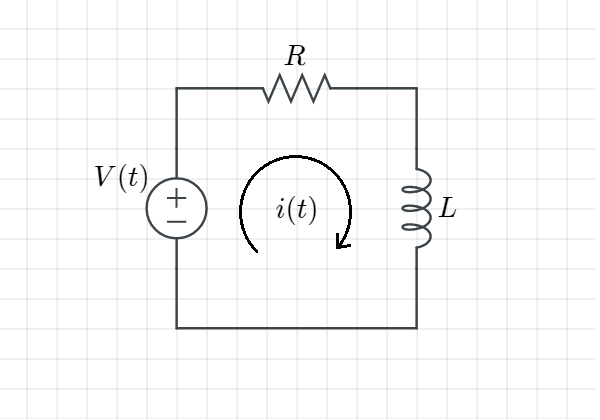
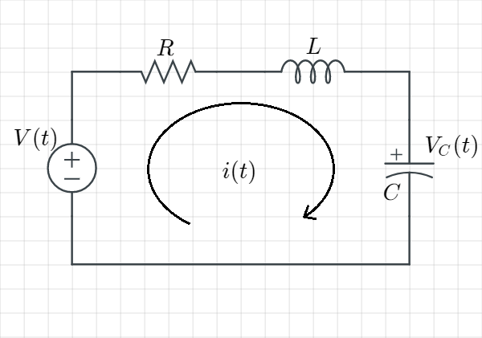
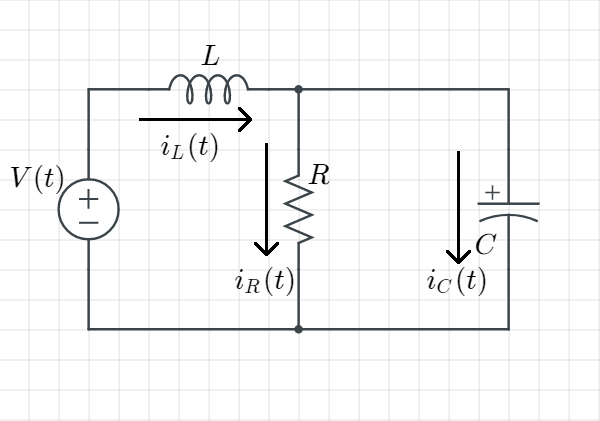

# 第三章 狀態方程式

- [第三章 狀態方程式](#第三章-狀態方程式)
  - [有兩種途徑可以用來 分析/設計 回授控制系統](#有兩種途徑可以用來-分析設計-回授控制系統)
  - [LTI Systems (線性非時變系統)](#lti-systems-線性非時變系統)
    - [Ex. 給定狀態方程式與輸出方程式](#ex-給定狀態方程式與輸出方程式)
    - [Ex. 推導以下RL電路的***狀態空間表示法***(輸入為$`v(t)`$、輸出為$`V_R(t)`$)](#ex-推導以下rl電路的狀態空間表示法輸入為vt輸出為v_rt)
    - [Ex. 推導以下RLC電路的***狀態空間表示法***(輸入為$`v(t)`$、輸出為$`V_L(t)`$)](#ex-推導以下rlc電路的狀態空間表示法輸入為vt輸出為v_lt)
      - [Ex. 續上題，令 狀態空間 $`x(t) = \left [ \begin{matrix} v_R(t) \\ v_C(t) \end{matrix} \right ]`$](#ex-續上題令-狀態空間-xt--left--beginmatrix-v_rt--v_ct-endmatrix-right-)
      - [Ex. 續上題，令 狀態空間 $`x(t) = \left [ \begin{matrix} q(t) \\ i(t) \end{matrix} \right ]`$，($`q`$為電量，$`q(t) = Cv_C(t)`$)](#ex-續上題令-狀態空間-xt--left--beginmatrix-qt--it-endmatrix-right-q為電量qt--cv_ct)
    - [Ex. 給定以下電路，求其狀態空間表示法，假設輸入為 $`v(t)`$、輸出為 $`i_R(t)`$](#ex-給定以下電路求其狀態空間表示法假設輸入為-vt輸出為-i_rt)

## 有兩種途徑可以用來 分析/設計 回授控制系統

|       |     Transfer function approach (轉移函數方法)      |        State-space approach (狀態空間方法)         |
| :---: | :------------------------------------------------: | :------------------------------------------------: |
| 描述  |                   頻域，經典做法                   |                   時域，現代方法                   |
| 優點  |           可以簡單地將互聯的子系統模型化           | 適用範圍廣闊，非線性、時變、非零初始條件都可以使用 |
| 缺點  | 適用性太侷限，只能用於線性非時變系統(或者近似於此) |                                                    |

狀態空間可分為兩個表示方程式：  

1. State equations 狀態：系統的內部訊號  
   $`\frac{dx_i(t)}{dt} = f_i[x_1(t), x_2(t), ......, x_n(t), u_1(t), u_2(t), ......, u_m(t)]`$  
2. Output equations  
   $`y_j(t) = g_j[x_1(t), x_2(t), ......, x_n(t), u_1(t), u_2(t), ......, u_m(t)]`$  

input  variables輸入變數：$`u_k(t), k = 1, ..., m`$  
output variables輸出變數：$`y_j(t), j = 1, ..., p`$  
state  variables狀態變數：$`x_i(t), i = 1, ..., n`$  

改寫成向量矩陣型式：  

input  vector輸入向量：$`u(t) = \left [ \begin{array}{c} u_1(t) \\ . \\ . \\ . \\ u_m(t)\end{array} \right ]`$  

output vector輸出向量：$`y(t) = \left [ \begin{array}{c} y_1(t) \\ . \\ . \\ . \\ y_p(t)\end{array} \right ]`$  

state  vector狀態向量：$`x(t) = \left [ \begin{array}{c} x_1(t) \\ . \\ . \\ . \\ x_n(t)\end{array} \right ]`$  

## LTI Systems (線性非時變系統)

State  equation: $`x'(t) = Ax(t) + Bu(t)`$  
Output equation:  $`y(t) = Cx(t) + Du(t)`$  

### Ex. 給定狀態方程式與輸出方程式

>State equation:
>>$`\frac{dx_1(t)}{dt} = a_{11}x_1(t) + a_{12}x_2(t) + b_{11}u(t)`$  
>>$`\frac{dx_2(t)}{dt} = a_{21}x_1(t) + a_{22}x_2(t) + b_{21}u(t)`$  
>
>Output equation:
>>$`y(t) = C_{11}x_1(t) + C_{12}x_2(t) + du(t)`$  
>
>則列出矩陣為：
>>$`A = \left [ \begin{matrix} a_{11} && a_{12} \\ a_{21} && a_{22} \end{matrix} \right ]`$, $`B = \left [ \begin{matrix} b_{11} \\ b_{21} \end{matrix} \right ]`$  
>>$`C = \left [ \begin{matrix} c_{11} && c_{12} \end{matrix} \right ]`$, $`D = d`$  

-------------------------------------------------------------------------------------------------------------------------------------------------------

### Ex. 推導以下RL電路的***狀態空間表示法***(輸入為$`v(t)`$、輸出為$`V_R(t)`$)

  

>用KVL寫出迴路方程式  
>>$`L\frac{di}{dt} + Ri = v(t)`$  
>
>把 $`i(t)`$ 當成狀態 $`x(t)`$ 並整理成  
>$`\left. \begin{array}{c}x'(t) = Ax(t) + Bu(t) \\ y(t) = Cx(t) + Du(t)\end{array} \right \}`$ 的型式  
>就得出此電路的狀態空間表示法  
>>狀態方程式：$`\frac{di(t)}{dt} = - \frac{R}{L}i(t) + \frac{1}{L}v(t)`$ --- [1]  
>>輸出方程式：$`v_R(t) = Ri(t)`$
>
>或者，如果把 $`v_R(t)`$ 當成狀態 $`x(t)`$  
>>>狀態方程式：$`\frac{dv_R(t)}{dt} = R\frac{di(t)}{dt}`$ ([1]式$`\times R`$) $`= -\frac{R}{L}Ri(t) + \frac{R}{L}v(t)`$  
>>>其中$`Ri(t) = v_R(t)`$  
>>>$`\Rightarrow \frac{dv_R(t)}{dt} = -\frac{R}{L}v_R(t) + \frac{R}{L}v(t)`$  
>>
>>>輸出方程式：$`v_R(t) = v_R(t)`$ (因為我們把輸出本身當作狀態)  
>>
>>得到此電路的狀態空間表示  
>>>狀態方程式：$`\frac{dv_R(t)}{dt} = -\frac{R}{L}v_R(t) + \frac{R}{L}v(t)`$  
>>>輸出方程式：$`v_R(t) = v_R(t)`$  

-------------------------------------------------------------------------------------------------------------------------------------------------------

### Ex. 推導以下RLC電路的***狀態空間表示法***(輸入為$`v(t)`$、輸出為$`V_L(t)`$)

  

>列出元件特性  
>>R: $`v_R(t) = i_R(t)R`$  
>>L: $`v_L(t) = L\frac{di_L(t)}{dt}`$  
>>C: $`i_C(t) = C\frac{dv_C(t)}{dt}`$  
>>
>用KVL列出一種狀態方程式  
>>把 $`i(t)`$ 當狀態 $`x(t)`$  
>>>$`-v(t) + Ri(t) + L\frac{di(t)}{dt} + v_C(t) = 0`$  
>>>$`\Rightarrow \frac{di(t)}{dt} = -\frac{R}{L}i(t) + v(t) - v_C(t)`$　　　　----state eq \[1\]  
>>
>>把 $`v_C(t)`$ 當狀態 $`x(t)`$  
>>>$`\frac{dv_C(t)}{dt} = \frac{1}{C}i(t)`$　　　　　　　　　　　 ----state eq \[2\]  
>>
>輸出方程式  
>>$`v_L(t) = L\frac{di_L(t)}{dt} = L\frac{di(t)}{dt = -Ri(t)} - v_C(t) + v(t)`$  
>
>令狀態空間state為$`x(t) = \left [ \begin{matrix} i(t) \\ v_C(t) \end{matrix} \right ]`$，則可以列式  
>>狀態方程式：$`\left [ \begin{matrix} \frac{di(t)}{dt} \\ \frac{dv_C(t)}{dt} \end{matrix} \right ] = \left [ \begin{matrix} -\frac{R}{L} && -\frac{1}{L} \\ \frac{1}{C} && 0  \end{matrix} \right ]\left [ \begin{matrix} i(t) \\ v_C(t)  \end{matrix} \right ] + \left [ \begin{matrix} \frac{1}{L} \\ 0 \end{matrix} \right ]v(t)`$  
>>輸出方程式：$`v_L(t) = \left [ \begin{matrix} v_L(t) \end{matrix} \right ] = \left [ \begin{matrix} -R \\ -1 \end{matrix} \right ]\left [ \begin{matrix} i(t) \\ v_C(t) \end{matrix} \right ] + \left [ \begin{matrix} 1 \end{matrix} \right ]v(t)`$  

-------------------------------------------------------------------------------------------------------------------------------------------------------

#### Ex. 續上題，令 狀態空間 $`x(t) = \left [ \begin{matrix} v_R(t) \\ v_C(t) \end{matrix} \right ]`$

-------------------------------------------------------------------------------------------------------------------------------------------------------

#### Ex. 續上題，令 狀態空間 $`x(t) = \left [ \begin{matrix} q(t) \\ i(t) \end{matrix} \right ]`$，($`q`$為電量，$`q(t) = Cv_C(t)`$)

***Rule：對RLC電路來說，可以選擇電容跨壓$`v_C(t)`$ 與 電感電流 $`i_L(t)`$ 作為狀態變數***  

-------------------------------------------------------------------------------------------------------------------------------------------------------

### Ex. 給定以下電路，求其狀態空間表示法，假設輸入為 $`v(t)`$、輸出為 $`i_R(t)`$

  

>選擇狀態空間  

$`x(t) = \left [ \begin{matrix} v_C(t) \\ i_L(t) \end{matrix} \right ]`$
